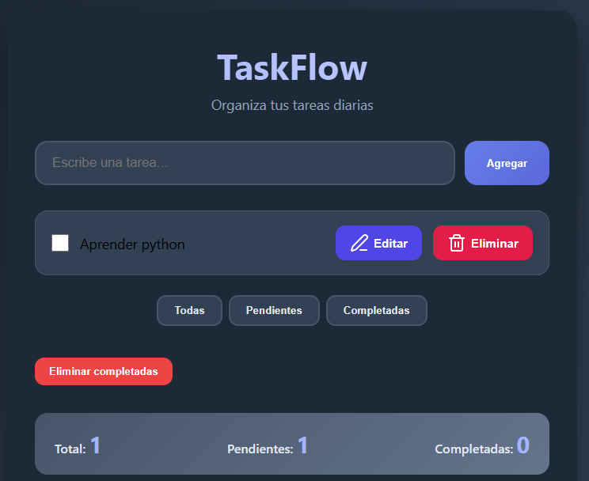

# TaskFlow

Una aplicación moderna y elegante para organizar tus tareas diarias.



## ✨ Características

- 🎨 Diseño moderno con **modo oscuro automático**
- 🖱️ **Drag & Drop** para reordenar tareas
- 📋 Filtros inteligentes (Todas / Pendientes / Completadas)
- ✏️ Edición inline de tareas
- 🗑️ Confirmación al eliminar y botón para eliminar completadas
- 💾 Guardado automático con LocalStorage
- 📱 **PWA** - Se puede instalar como aplicación nativa
- 🌟 Animaciones suaves y experiencia fluida
- 📱 Totalmente responsive

## 🚀 Cómo probarlo

1. Clona el repositorio:
   ```bash
   git clone https://github.com/tu-usuario/taskflow.git